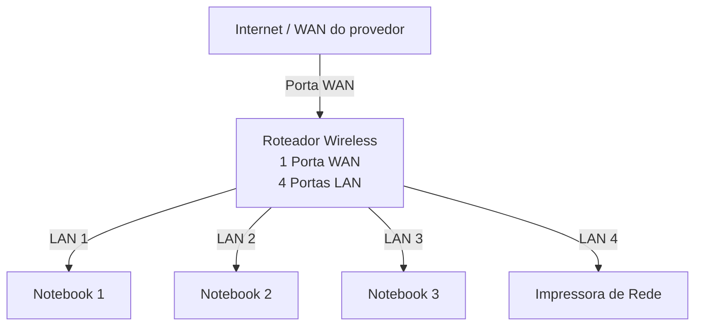
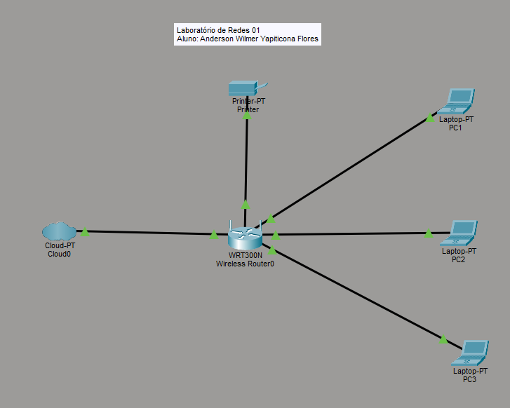
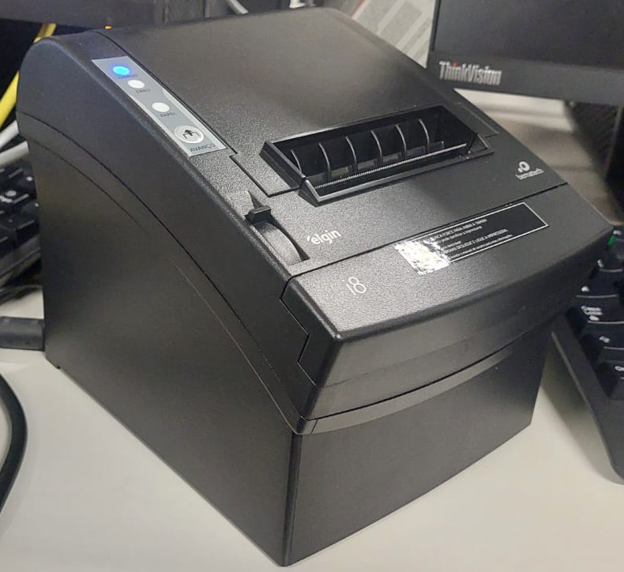

 -

# Laboratório de Redes 01 - Projeto de Rede Local

**Unidade Curricular 5 - SENAC**

> **Data:** 04 a 09 de março de 2026

**Aluno:** Anderson Wilmer Yapiticona Flores  
**Professor:** José de Assis  

---

## 1. Objetivo
Implementar uma rede local simples conectando 3 notebooks a um roteador wireless com switch e uma impressora de rede.

O projeto será dividido em duas etapas:

1. Simulação da rede no Cisco Packet Tracer
2. Implementação da rede no laboratório real

---

## 2. Equipamentos utilizados neste laboratório

- 3 notebooks
- 1 roteador wireless com 1 porta WAN e 4 portas LAN
- 1 impressora de rede
- cabos de rede

---

## 3. Topologia da Rede

Diagrama lógico da rede usada neste laboratório.

### Imagem da topologia usada neste laboratório:

---

## 4. Plano de endereçamento IP

Rede: 192.168.0.0/24

Gateway: 192.168.0.1

| Dispositivos | Tipos de IP | Endereçamento IP | Observação |
|--------------|-------------|------------|-------------|
| Roteador | Estático | 192.168.0.1 | IP do roteador |
| Impressora | Reserva DHCP | 192.168.0.102 | IP reservado pelo roteador |
| PC1 | Reserva DHCP | 192.168.0.103 | IP reservado pelo roteador |
| PC2 | DHCP | Automático | IP atribuído pelo roteador |
| PC3 | DHCP | Automático | IP atribuído pelo roteador |

**Observação**

- A impressora e um dos notebooks utilizam reserva DHCP.
- O roteador sempre atribuí o mesmo endereço IP a esses dispositivos.

---

## 5. Implementação do laboratório real

Após a instalação, a rede foi montada fisicamente no laboratório.

### Etapas realizadas:

### Testes:

---

## 6. Conclusão

Este laboratório permitiu compreender o funcionamento de uma rede local, incluindo:

- Estrutura de uma rede doméstica ou de pequeno escritório
- Utilizando de um roteador com porta WAN e portas LAN
- Funcionamento do DHCP
- Comunicação entre dispositivos na rede local
- Utilização de uma impressora de rede
- Compartilhamento de pasta na rede usando o Windows
